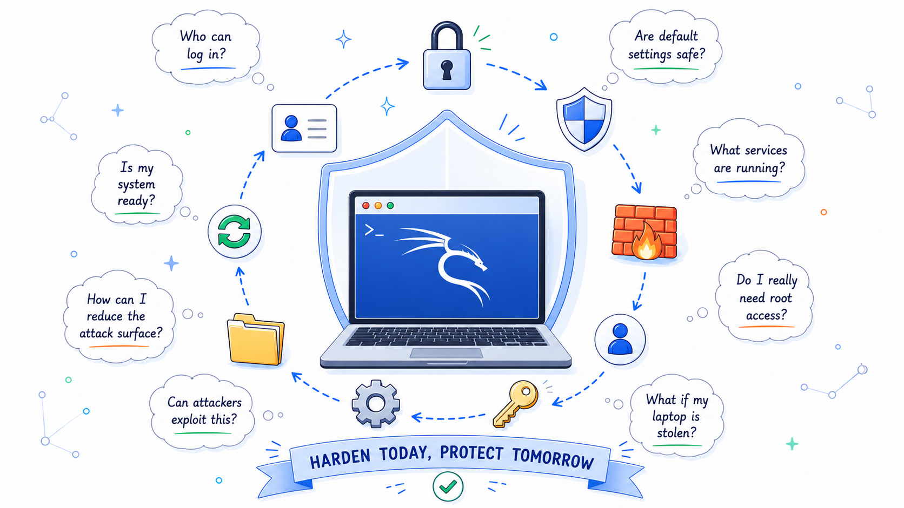
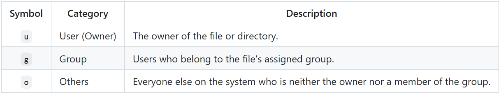
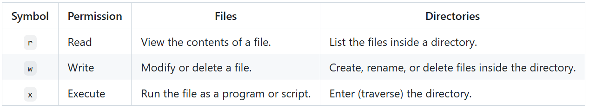

# Ethical Hacking Day 2 Part I: Kali Linux Security Hardening.

It’s an intermediate, practical guide on what and how you can secure Kali Linux.



**Welcome to Day 2 Part I of our Ethical Hacking Journal.**

Before testing others’ defenses, it’s important to understand how to defend your own system. In other words, ethical hacking means to bypass the defense others have created. In this reading, you will learn several basic hardening concepts and practical commands to make a Kali Linux system more secure.

>A secure system isn’t the one that has never been attacked. It’s the one that’s prepared when attacks happen.

**A little bit of preparations:**
- A computer installed Kali Linux/Linux

**Note:** You can view the previous blog to learn how to install you Kali Linux. LINK: [HERE](https://github.com/Tech-FireFish/Ethical-Hacking-Blog/blob/main/Day1.md)

Let’s dive in now. 😄

**Keep The System Updated**

Every operating system contain glitches. Some of these glitches are harmless to the overall function, while some of these glitches can lead to serious financial consequences once they are exploited by malicious attackers. Keeping your system updated ensures that these vulnerabilities are patched before they are exploited.

In Linux, we use:

```
# list available updates
sudo apt update
```

to search for a list of updates available. And, we use:

```
# download and install those available updates
sudo apt upgrade
```

to download and install these available updates.


**Manage user/group access and privileges**
***PART I : USER***

One of the most important concepts in cybersecurity is the principle of least privilege. In other words, each user should only have the necessary access and permission for their work. Thus, even if their accounts are compromised, the damage that an attacker can do is limited.

Starting with basics:

```
# adds a new user to the system
sudo adduser [username]
# e.g. sudo adduser Tech-FireFish
# adds Tech-FireFish as a new user to the system
```

**adds a new user** to the system with a specific username. This would allow you to keep assets separated and organized. In case you don’t want certain assets to be accessible to others, you can use:

```
# removes read(r), write(w), and execute(x) permission.
# of a specific file from others(o).
sudo chmod o-rwx [filename]
# e.g. sudo chmod o-rwx SectionONE
# removes all three permissions of SectioinONE from others.
```

This command **removes read(r), write(w), and execute(x) permission of a specific user from others(o).**

**Specifically:**





On the other hand, you might want to delete a user for security reasons, let’s say an individual is no longer active. It’s a good idea to remove him access from the system. In this case, we use:

```
# delete a specific user
sudo deluser [username]
# sudo deluser Tech-FireFish
# deletes Tech-FireFish from the system
```

**to delete a specific user from the system.**

**PART II : GROUP**

Suppose a you’re working on a porject with several teammates, if you want to share the files with a new user. You can add the new user into your groups, so he can access the files that the group members have access to.

**By default, Linux creates a personal group for each new user.** Users can also belong to additional groups that grant access to shared resources. You can use:

```
# add a specific user to a specific group.
sudo usermod -aG [group_name] [username]
# e.g. sudo usermod -aG projectOne Tech-FireFish
# adds user Tech-FireFish to group projectONE.
```

to **add a specific user to a specific group as its secondary group.**

The `-aG` has two options: `-a` means to append, and `-G` indicates a secondary group. In this case, `-aG` appends a secondary group.

As you might raise questions about changing the primary group of a specific user. You can use the `-G` option only to change the primary group of a specific user.

On the other hand, if you want to check groups that a specific user has:

```
# check groups that a specific user has.
groups [username]
# e.g. groups Tech-FireFish
# checks gourps that Tech-FireFish has.
```

If you are looking forward to **removing a specific user from a specific group:** `

```
# remove a specific user from a specific group
sudo gpasswd -d [username] [group_name]
# e.g. sudo gpasswd -d Tech_FireFish ProjectONE
# removes user Tech_FireFish from ProjectONE
```

Next, assuming you have too much work at your hands, and you want to distribute them to the group leaders so they can help you out, and have them in charge of the files. You can use:

```
# change the ownership of both user and group
sudo chown [username]:[group_name] [filename]
# sudo chown Tech-FireFish ProjectONE sectionONE
# change the user ownership of file sectionONE to Tech-FireFish
# change the group ownership of file sectionONE to ProjectONE
```

**to change the ownership of both user and group.**

**Only user ownership changes:** `sudo chown [username] [filename]`.

**Only group ownership changes:** `sudo chown :[group_name] [filename]`.

**Congratulations. You made it all the way here.**😄

In Part II, we’ll continue hardening Kali Linux by configuring the firewall, securing remote access, and exploring additional defensive tools.

# Credits

- Tech-FireFish, Contributor, [Profile_URL](https://github.com/Tech-FireFish)
- IBM Ethical Hacking with Open Source Tools Professional Certificate instructed by IBM Skills Network Team, Dee Dee Collette, Christo Oehley on Coursera platform, 2024, [URL](https://www.coursera.org/professional-certificates/ibm-ethical-hacking-with-open-source-tools).
