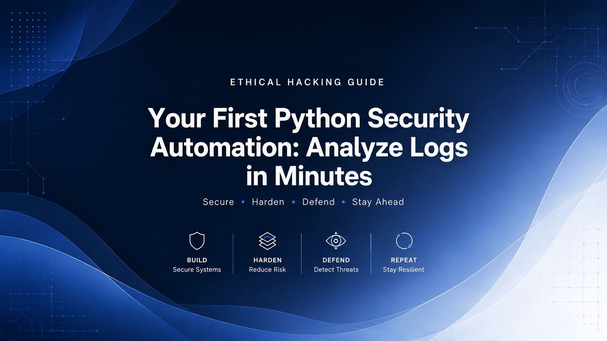

# Your First Python Security Automation: Analyze Logs in Minutes

An beginner/intermediate, practical guide on automating your log review. Day 6 of Ethical Hacking Journal.



Welcome to Day 6 of our Ethical Hacking Journal : Python Basics Part II. (PART I is [HERE](https://github.com/Tech-FireFish/Ethical-Hacking-Blog/blob/main/EHDay5.md))

**Review Question of the day: What do you think this program will print?**

```
import shutil
total, used, free = shutil.disk_usage("/")
usage_percent = used/total * 100
print(f"Disk usage is at {usage_percent: .3f}%!")
```

CHOICES :

1. Syntax Error
2. It depends on how much disk space is being used.

**The answer is at the beginning of the article.**

>A security analyst doesn’t want to read thousands of log entries manually. What if Python could do the first round of investigation for you?

If you did like to practice the commands, you’ll need:

- A code editor (e.g., Visual Studio Code[Download](https://code.visualstudio.com/download?))
- Python (Download [HERE](https://www.python.org/downloads//))

**Note:** You don’t have to download a code editor if you’re using Kali Linux. In your terminal, you can run `nano filename.py` to create and edit a Python file.

Let’s dive in now. 😄

### Question of The Day Answer
THE CORRECT CHOICE IS **CHOICE 1 : YES.**

Previously, we learned that the keyword `import` followed by function names connects our current program to functions that are defined outside of our program. Thus:

**Line 1** `import shutil` imports a module named shutil from Python’s standard library.

>Pro Tip: a module is a Python file that contains a series of functions, classes, variables, and other code.

**Line 2** `total, used, free = shutil.disk_usage(“/”)` uses multiple assignment to assign the three values returned by `shutil.disk_usage(“/”)` to three variables. For example `a, b, c = 1, 2, 3` specify `a=1`, `b=2` and `c=3`. In our question, each variable is assigned to a corresponding value.

**Line 3** `usage_percent = used/total` simply means variable `usage_percent` is assigned to the result of variable `used` divided by variable `total`.

**Line 4** `print(f”Disk usage is at {usage_percent: .3f}%!”)` used a different way to print variables. This way you can display the content of a variable inside a string.

>Pro Tip: This is called an f-string. By placing f before the string, you can insert variables or expressions directly inside {}.

Now, let’s talk about the confusing `.3f` phrase. `.[number]f` changes how the number is displayed; it does not change the original value stored in the variable. `.3f` tells Python to display the number with three digits after the decimal point.

### Data Types
Before we automate our log review, let’s look at the kinds of data our program will work with. Python uses different data types to represent different kinds of information.

Today, we will review and learn some more data types. Reflecting on the question, the data types for numerical values are `int` and `float`. Specifically, the int referred to integer, while float referred to the number with decimals, like the one we used in our question. String data type has its type name too, it’s `str`.

>An `int` represents a whole number, such as `10` or `42`. A float represents a number with a decimal component, such as `3.14` or `72.5`.

Type names like `str`, `int`, and `float` also have functions that you can use to convert a data type to another. For example, you can run `str(123)` to convert the number 123 from int data type to a string `“123”`.

Different data types support different operations. For example, Python can add two numbers, and it can join two strings, but it cannot directly add a string and an integer.

For example, `"1" + "1"` produces `"11"` because Python joins the two strings together. On the other hand, `1 + 1` produces `2` because both values are integers.

However, if you run `"1" + 1` , you are will result in a type error because the two values have incompatible types for this operation.

A security analyst rarely works with just one log entry. A log file may contain thousands of them. Python’s list data type allows us to store multiple values in a single collection:

- List data is a data structure that consists of an ordered collection of values. You can use square brackets `[]` to create a list, with a comma to separate each value. (e.g., `[1,2,3,4,5]` , `[True, False, False, True]`, `[“approved”,”rejected”,”processing”]`)

The practice of list is actually very common, consider this list of log data below.

```
log_entries = [
    "2026-08-06 10:00:01 INFO User logged in successfully",
    "2026-08-06 10:01:15 WARNING High memory usage detected",
    "2026-08-06 10:02:30 ERROR Database connection failed",
    "2026-08-06 10:03:00 INFO User logged out",
    "2026-08-06 10:04:12 ERROR Timeout while fetching user profile",
    "2026-08-06 10:05:00 WARNING Disk space low"
]
```

In order to filter out the number of `ERROR` and `WARNING` from this list, you will want to compare each value to the these keywords themselves.

This comparison in terms of code is actually simple in Python. You will want to run a loop and then compare each value with these keywords.

### For Loop

Now, we have a list containing several log entries. In order to examine each entry and look for anything important, we will need learn about loops.

- For loop repeats a block of code once for each item in a collection. You can use `for [loop_variable] [operator] [object(s)_list]: [action(s)]` to specifies times of iteration in a specific sequence. (e.g., `for i in range(0,10): print(i)` displays 0–9 on the screen)

>Pro Tip:`range([start_value],[end_value],[value_of_change](optional))` specifies a sequence that will increase/decrease by a specific numerical value and only stops when the one value before the end_value is reached.

If you remember the variable assignment early, this is a similar situation where the value used inside the loop will be different each time, because what a loop does for you is that it looks over each value in a list you provided.

Therefore, when you start to write a loop, you want to make sure you specify a variable for the information to be stored for each execution of codes that are inside the loop.

You can run `for [variable_name] in [list]` to specify how many times you want the execution to be.

pro tip: `in` operator checks whether a value is an element of a sequence.

```
# Display every value inside 'log_entries' list
for log in log_entries:
    print(log)
# OUTPUT:
# 2026-08-06 10:00:01 INFO User logged in successfully
# 2026-08-06 10:01:15 WARNING High memory usage detected
# 2026-08-06 10:02:30 ERROR Database connection failed
# 2026-08-06 10:03:00 INFO User logged out
# 2026-08-06 10:04:12 ERROR Timeout while fetching user profile
# 2026-08-06 10:05:00 WARNING Disk space low
```

With this knowledge, you might write: `for log in log_entries:` to specify that for each iteration, the value in the list `log_entries` will be stored in variable log.

This `in` operator can also be applied in a string which is also known as a sequence of characters.

So, it’s actually much easier for your if-else statement when checking if a keyword exist in a sequence.

You can actually write `if “ERROR” in log` to check if the keyword `“ERROR”` appears in that log review.

```
# Filter 'log_entries' list
for log in log_entries:
    if "ERROR" in log:
        print(log)
# OUTPUT:
# 2026-08-06 10:02:30 ERROR Database connection failed
# 2026-08-06 10:04:12 ERROR Timeout while fetching user profile
```

### While Loop

Python also provides `while` loops, which repeat code while a condition remains true. We’ll not go in deep with it in this article.

- While loop continues while the condition is True and stops when it becomes False. You can run `while [condition(s)] : [action(s)]` to instructs the program to repeatedly execute action(s) until the condition(s) have been evaluated to True.

For example, the following will print 1 to 9:

```
# Assign 0 to variable i
i = 0
# Create a While loop
while i < 10:
print(i)
i = i + 1
```

### Len()

Lastly, I want to introduce you to the `len()` function.

In our project, `len()` helps us count how many log entries we processed. In whcih is helpful when calculating the numerical values like total error occurred in the log review, or similar stuff.

You can run len(log_entires) to check how many values are contained in that log.

### Summary In Code

Everything you learned today is summarized in a small script for automating log review. You should now be able to understand the script below. You might want to do some research on `append()` on your own.

```
# 1. Sample log data (represented as a list of strings)
log_entries = [
    "2026-08-06 10:00:01 INFO User logged in successfully",
    "2026-08-06 10:01:15 WARNING High memory usage detected",
    "2026-08-06 10:02:30 ERROR Database connection failed",
    "2026-08-06 10:03:00 INFO User logged out",
    "2026-08-06 10:04:12 ERROR Timeout while fetching user profile",
    "2026-08-06 10:05:00 WARNING Disk space low"
]


# Lists to store filtered results
error_logs = []
warning_logs = []
info_logs = []


# 2. Loop through each log entry using a for loop
for log in log_entries:
    # Use if-else statements to categorize the logs
    if "ERROR" in log:
        error_logs.append(log)
    elif "WARNING" in log:
        warning_logs.append(log)
    else:
        info_logs.append(log)


# 3. Output the Summary Report
print("=== LOG REVIEW SUMMARY ===")
print(f"Total Logs Processed: {len(log_entries)}")
print(f"Errors Found: {len(error_logs)}")
print(f"Warnings Found: {len(warning_logs)}")
print(f"Info Logs: {len(info_logs)}")
print("=" * 26)

# OUTPUT:
#=== LOG REVIEW SUMMARY ===
# Total Logs Processed: 6
# Errors Found: 2
# Warnings Found: 2
# Info Logs: 2
# ==========================
```

Congratulations. You made it all the way here. 😄

**Credits**
- Tech-FireFish, Contributor, Profile [URL](https://github.com/Tech-FireFish)

- IBM Ethical Hacking with Open Source Tools Professional Certificate instructed by IBM Skills Network Team, Dee Dee Collette, Christo Oehley on Coursera platform, 2024, [URL](https://www.coursera.org/professional-certificates/ibm-ethical-hacking-with-open-source-tools).
